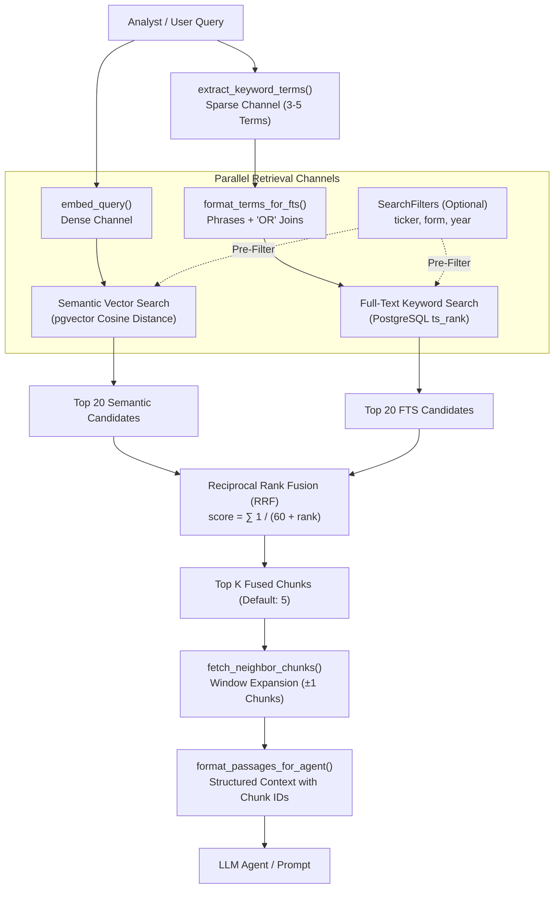

# SEC Filing Retrieval Pipeline

This package implements the **Hybrid Retrieval Pipeline** for SEC 10-K filings, combining dense semantic vector search (`pgvector`) and sparse full-text keyword search (`tsvector`) via Reciprocal Rank Fusion (RRF) and neighbor-context window expansion.

---

## Architecture & Pipeline Flow



---

## Default Settings & Parameters

| Parameter | Default Value | Location | Description |
| :--- | :---: | :--- | :--- |
| **Embedding Model** | `text-embedding-004` | `app/config.py` | Google Gemini dense embedding model. |
| **Embedding Dimensions** | `768` | `app/database/models/common.py` | Vector dimensionality stored in `DocumentChunk.embedding`. |
| **Vector Index Type** | `HNSW` (`m=16`, `ef=64`) | `app/database/models/document_chunk.py` | Hierarchical Navigable Small World graph index using `vector_cosine_ops`. |
| **Keyword Extractor** | `gemini-3.6-flash` | `app/retrieval/keyword_extraction.py` | Extracts 3 to 5 financial terms/phrases (with rule-based heuristic fallback). |
| **Extracted Terms Count** | `3 to 5` | `app/retrieval/keyword_extraction.py` | Line items, segments, metrics, and entity names for sparse retrieval. |
| **Full-Text Parser** | `websearch_to_tsquery` | `app/retrieval/queries.py` | Natural language parser with phrase quoting and `OR` boolean disjunction. |
| **Candidate Retrieval Limit** | `20` | `app/retrieval/retriever.py` | Number of candidate chunks retrieved from each channel before fusion. |
| **RRF Constant ($k$)** | `60` | `app/retrieval/fusion.py` | Standard smoothing constant for Reciprocal Rank Fusion. |
| **Top K Passages** | `5` | `app/retrieval/retriever.py` | Final number of fused chunks selected for context. |
| **Context Window** | `1` (`±1` chunk) | `app/retrieval/retriever.py` | Adjacent preceding and succeeding chunks pulled for narrative continuity. |

---

## How The Pipeline Works

### 1. Dense Query Encoding & Embedding
The natural language question is embedded using the Google Gemini API (`text-embedding-004`) to produce a 768-dimensional dense vector for semantic similarity matching.

### 2. Keyword Term Extraction & FTS Formatting
Conversational questions often contain interrogatives or words not found in official SEC 10-K tables. To prevent full-text search from missing relevant sections:
1. `extract_keyword_terms()` extracts 3 to 5 high-signal financial keywords or phrases (e.g. `["total net sales", "iPhone", "fiscal 2022"]`).
2. `format_terms_for_fts()` encloses multi-word phrases in quotes and joins with `OR` (e.g., `"total net sales" OR iPhone OR "fiscal 2022"`), ensuring PostgreSQL matches any exact phrase and ranks documents by how many terms they match.
3. Automatically falls back to a deterministic, rule-based financial heuristic extractor if the Gemini API is rate-limited or unavailable.

### 3. Dual-Channel Search with Pre-Filtering
- **Semantic Vector Search**: Computes cosine distance against the HNSW index in PostgreSQL (`DocumentChunk.embedding.cosine_distance(query_embedding)`).
- **Full-Text Search (FTS)**: Matches extracted keyword phrases against the `content_search` tsvector column (`@@ websearch_to_tsquery('english', formatted_fts_query)`).
- **Metadata Pre-Filtering**: When `SearchFilters(ticker=..., form=..., year=...)` is supplied, an SQL `JOIN` on `source_documents` filters records *before* ranking.

### 3. Reciprocal Rank Fusion (RRF)
Merges ranked lists without needing score normalization:
$$\text{RRF Score}(d) = \sum_{m \in \{\text{semantic}, \text{fts}\}} \frac{1}{60 + \text{rank}_m(d)}$$
Chunks present in both channels receive the highest boost.

### 4. Context Window Expansion (`window = 1`)
Rather than relying on oversized chunks that blur embedding precision, the pipeline retrieves compact chunks (~500 tokens) and fetches the adjacent chunks (`chunk_index - 1` and `chunk_index + 1`) via B-tree index to guarantee complete sentences and unbroken financial context.

### 5. Structured Agent Formatting
Passages are formatted with header metadata, chunk UUIDs, and section headings:
```text
AAPL 10-K FY2024 (Item 7) [15515dac-0fd9-4e50-a55c-f5b6c0685524]:
Total net sales increased 2% or $8.1 billion during 2024 compared to 2023...
```

---

## Programmatic Usage

```python
from app.retrieval.retriever import DocumentRetriever, SearchFilters, format_passages_for_agent

# 1. Initialize retriever
retriever = DocumentRetriever()

# 2. Search with optional metadata filter
filters = SearchFilters(ticker="AAPL", form="10-K", year=2024)
passages = retriever.search("What was total net sales and iPhone performance?", filters=filters, top_k=5)

# 3. Format output
print(format_passages_for_agent(passages))
```

To run the smoke verification suite:
```bash
uv run python scripts/smoke_retrieval.py
```
